### Before Optimization

| Operation              | Duration | Screnshot                                                    |
| ---------------------- | -------- | ------------------------------------------------------------ |
| Sorting by population  | 440ms    | 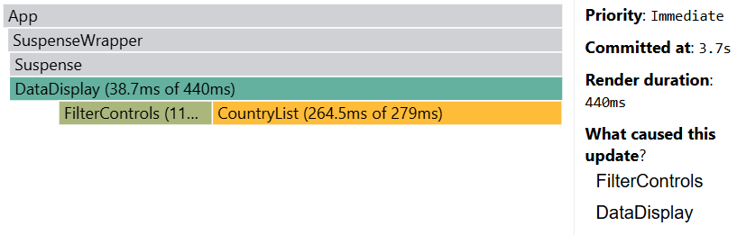 |
| Searching a country    | 271ms    | 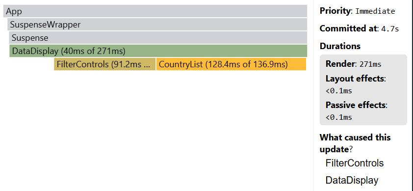 |
| Selecting another year | 173ms    | 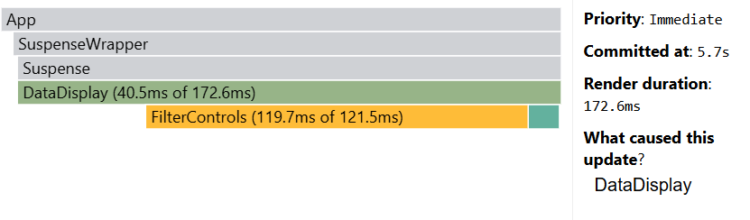 |
| Removing columns       | 229ms    | 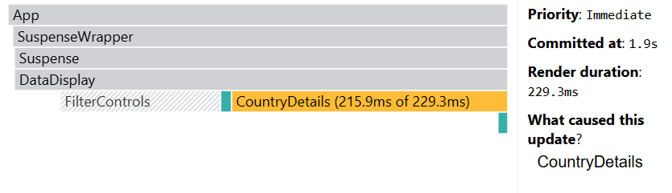 |
| Adding columns         | 383ms    | 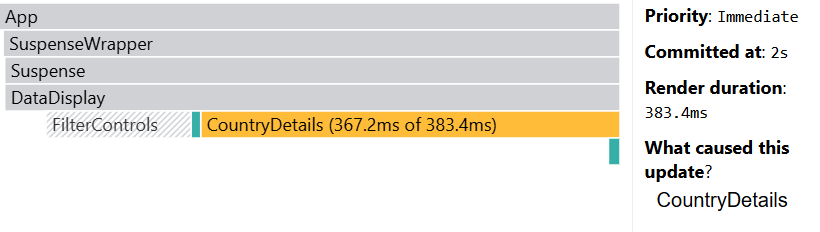 |
| Filter by region       | 375ms    | 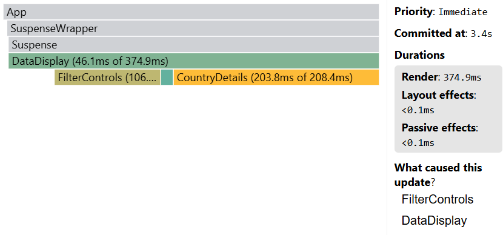 |
| Change sort order      | 625ms    | 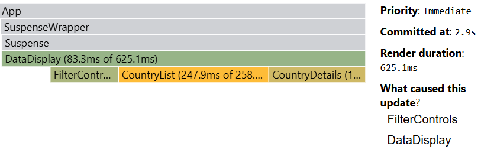 |

Ranked chart 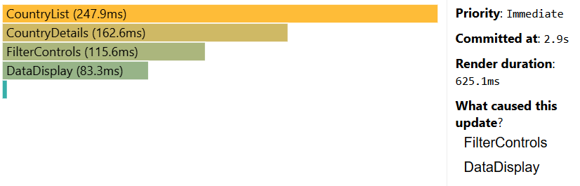
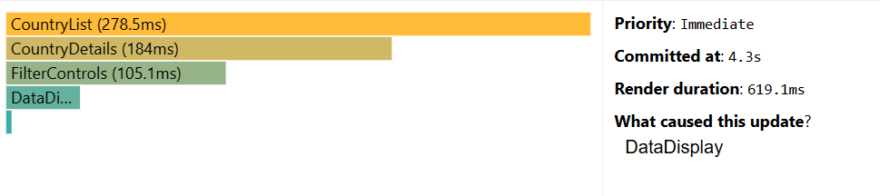

### After Optimization

| Operation              | Duration after (before) optimisation | Screnshot                                                          |
| ---------------------- | ------------------------------------ | ------------------------------------------------------------------ |
| Sorting by population  | 154 (440) ms                         | 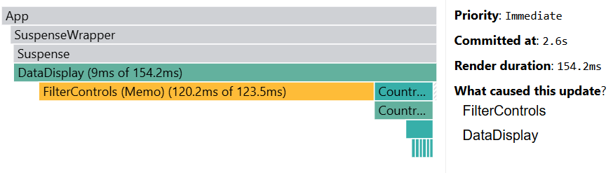   |
| Searching a country    | 103 (271) ms                         | 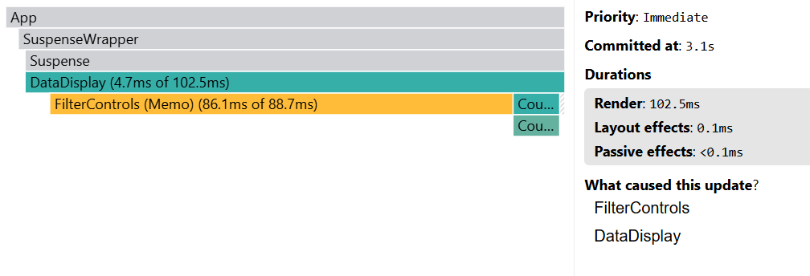 |
| Selecting another year | 136 (173) ms                         | 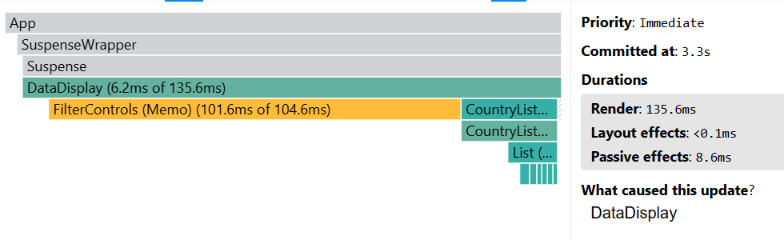 |
| Removing columns       | 190 (229) ms                         | 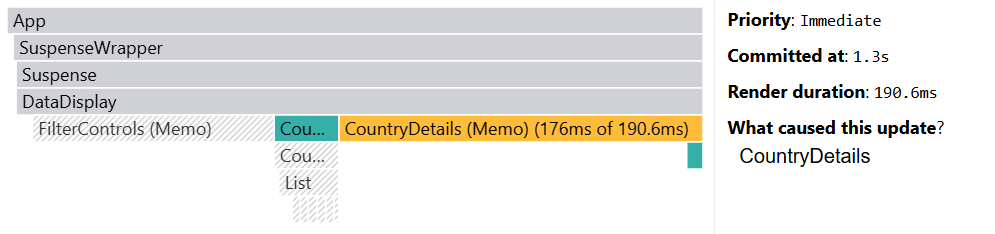 |
| Adding columns         | 192 (383) ms                         | 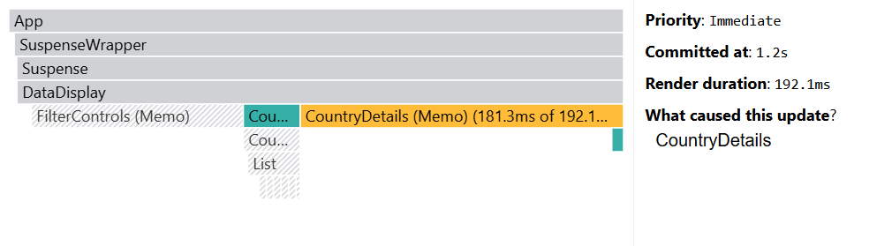 |
| Filter by region       | 162 (375) ms                         | 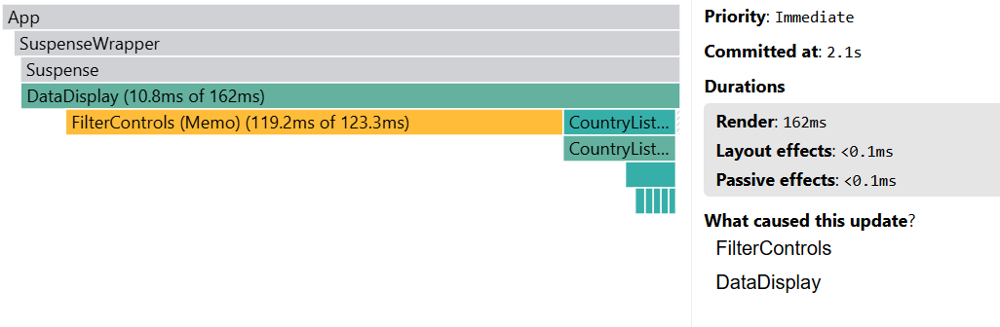 |
| Change sort order      | 153 (625) ms                         | 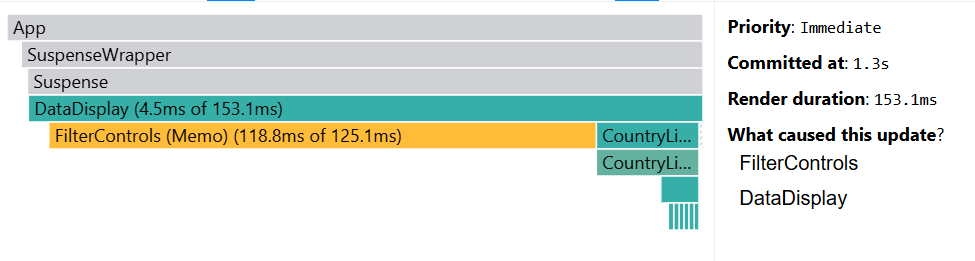 |

Ranked chart 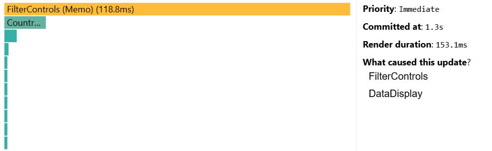
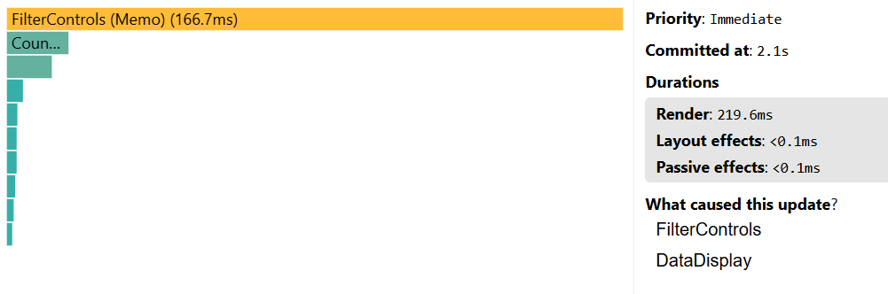
